<h3><code>Prasadhol2001@github ~ $ ./contributions.sh</code></h3>

  

<h3><code>Prasadhol2001@github ~ $ whoami</code></h3>
<table>
  <tr>
    <td valign="top"></td>
    <td valign="top"></td>
  </tr>
</table>

---

# 💫 About Me
🚀 **Flutter Developer** | 📱 **Mobile App Enthusiast** | 🔗 **API Integrator** | 🔥 **Firebase Expert**

Hi there! I'm a passionate **Flutter Developer** with solid experience in **full-cycle mobile application development**. I specialize in building high-quality, scalable apps from the ground up and optimizing existing projects for better performance and user experience.

### 💡 What I Do
- ✨ Develop beautiful, responsive apps using **Flutter & Dart**
- 🌐 Seamlessly integrate **RESTful APIs**
- 🔥 Leverage **Firebase** (Auth, Firestore, Cloud Messaging, etc.)
- 🛠️ Implement effective **state management** (GetX, Provider, Bloc)
- 🧪 Focus on clean architecture, performance, and testability

### 🧰 Tech Stack
- Flutter, Dart
- Firebase (Auth, Firestore, Cloud Functions, etc.)
- REST APIs, JSON
- Git, GitHub, CI/CD
- State Management (GetX / Provider / Bloc)

---

## 🌐 Socials
 

---

# 💻 Tech Stack
      

---

# 📊 GitHub Stats
 
 

---

