  

<h3><code>Prasadhol2001@github ~ $ ./contributions.sh</code></h3>

  

<h3><code>Prasadhol2001@github ~ $ whoami</code></h3>
<table>
  <tr>
    <td valign="top"></td>
    <td valign="top"></td>
  </tr>
</table>

  

<h3><code>Prasadhol2001@github ~ $ ./recent_activity.sh</code></h3>

---

# 📱 Featured Production Mobile Applications

<b>🎓 Edrilla – Learning Management System (LMS)</b>

 

**Tech Stack**: `Flutter` `BLoC` `WebSocket` `Firebase` `VideoCypher DRM` `Clean Architecture` `iOS & Android`  
 

- 🏗️ **Clean Architecture + BLoC**: Designed scalable LMS architecture using BLoC pattern, improving code scalability by **50%**.
- 🔒 **Secure DRM Video Streaming**: Built video streaming modules with VideoCypher DRM and multi-lesson modules, increasing session stability by **30%**.
- ⚡ **Real-Time WebSockets**: Developed real-time chat and video progress sync using WebSockets with 0–1 sec latency, boosting engagement by **45%**.
- 🛡️ **Advanced Security Features**: Implemented screenshot & screen-recording protection (**100% prevention**) and root/jailbreak detection (**+40% security**).
- 💬 **Community & Monetization**: Built Forum system, Gigs module, and Events feature, increasing platform engagement and retention by **25–35%**.

 

<b>🛍️ Zyclo – Quick Commerce Fashion Platform (Customer & Delivery Partner Apps)</b>

 

**Tech Stack**: `Flutter` `Provider` `Firebase` `Google Maps API` `Razorpay` `COD` `iOS & Android`  
 

- 🚀 **Full-Cycle App Development**: Built customer and delivery partner apps from scratch, achieving **25% performance gain** via optimized state management.
- 🗺️ **Real-Time GPS Tracking**: Integrated Google Maps API for live order tracking and route optimization, reducing delivery delays by **30%**.
- 💳 **Dual Payment Gateways**: Integrated COD and Razorpay, reducing checkout failures by **18%** and increasing completions by **22%**.
- 🚚 **Delivery Partner Suite**: Order pickup, live status updates, earnings dashboard, and audio alerts, improving driver efficiency by **25%** and response time by **40%**.

 

<b>🎫 Hemz – Event Booking & Ticketing Platform</b>

 

**Tech Stack**: `Flutter` `GetX` `Razorpay` `SQLite` `QR Verification` `Android`  

- ⚡ **High-Performance Architecture**: Architected entire platform using Flutter + GetX, improving navigation speed and UI responsiveness by **35%**.
- 🎟️ **QR Ticket Verification**: Developed QR-based ticket generation and instant scanner validation, reducing event entry time by **40%**.
- 💾 **Payment Optimization & Offline Storage**: Integrated Razorpay with a **20% reduction in payment failures** and implemented SQLite for offline ticket access.

 

<b>📰 LionExpress – 24/7 Live News & Shorts Media App</b>

 

**Tech Stack**: `Flutter` `GetX` `SQLite` `Firebase Cloud Messaging` `Shorts / Reels` `REST APIs` `iOS & Android`  
 

- 📺 **Live Streaming & News Reels**: Watch 24/7 live news streams and swipeable short news reels with fast performance across all devices.
- 🔔 **Instant Breaking Alerts**: Firebase Cloud Messaging (FCM) integration for real-time breaking news notifications.
- 📂 **Category & Local News Coverage**: Topic filtering, city-level news coverage, bookmarking, and instant social sharing.
- 💾 **Offline Caching & Dark Mode**: Local SQLite database for offline article reading and smooth dark mode UI.

---

# 💫 About Me
🚀 **Flutter Developer** | 📱 **Mobile App Enthusiast** | 🔗 **API Integrator** | 🔥 **Firebase Expert**

Hi there! I'm a passionate **Flutter Developer** with solid experience in **full-cycle mobile application development**. I specialize in building high-quality, scalable apps from the ground up and optimizing existing projects for better performance and user experience.

### 💡 What I Do
- ✨ Develop beautiful, responsive apps using **Flutter & Dart**
- 🌐 Seamlessly integrate **RESTful APIs**
- 🔥 Leverage **Firebase** (Auth, Firestore, Cloud Messaging, etc.)
- 🛠️ Implement effective **state management** (GetX, Provider, Bloc)
- 🧪 Focus on clean architecture, performance, and testability

### 🧰 Tech Stack
- Flutter, Dart
- Firebase (Auth, Firestore, Cloud Functions, etc.)
- REST APIs, JSON
- Git, GitHub, CI/CD
- State Management (GetX / Provider / Bloc)

---

## 🌐 Socials
 

---

# 💻 Tech Stack
      

---

# 📊 GitHub Stats
 
 

---

